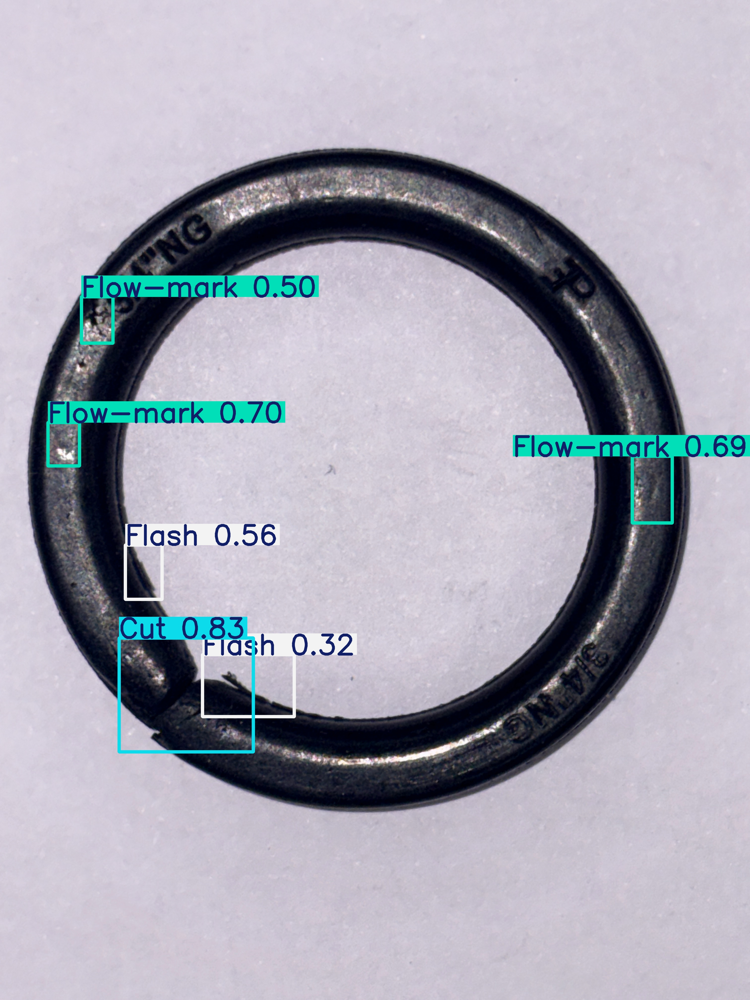

# O-Ring Defect Detection using YOLOv8n

Edge-deployable industrial O-ring defect detection system using YOLOv8n.

## 📌 Project Overview

This project implements a machine-learning-based automated inspection system for detecting surface defects in industrial O-rings.

The system:
- Trains a lightweight YOLOv8n model
- Achieves high detection accuracy
- Supports real-time inference
- Is designed for edge deployment

---

## 🧠 Defect Classes

The model detects four classes:

- Good
- Cut
- Flash
- Flow-mark

---

## 🏗 Project Structure

```
O-Ring-Defect-Detection-YOLOv8n/
│
├── train/
│   └── train.py
│
├── inference/
│   └── realtime_inference.py
│
├── configs/
│   └── data.yaml
│
├── results/
│
├── sample_images/
│
├── requirements.txt
├── .gitignore
└── README.md
```

## 🚀 Training

Install dependencies:
pip install -r requirements.txt

Run training:
python train/train.py --data configs/data.yaml


---

## 🎥 Real-Time Inference

Run real-time detection:
python inference/realtime_inference.py --weights path_to_best.pt


Press `q` to exit the camera window.

---

## ⚙️ Configuration

Dataset path is configured in:
configs/data.yaml


Update the `path` field to match your dataset location before training.

---

## 📦 Requirements

- ultralytics
- torch
- opencv-python
- numpy

Install using:
pip install -r requirements.txt


---

## 📌 Notes

- Dataset is not included in this repository.
- Trained model weights (`.pt`) are not included.
- Designed for real-time edge deployment.

---

## 📊 Sample Detection Result

Below is a sample real-time detection output:


